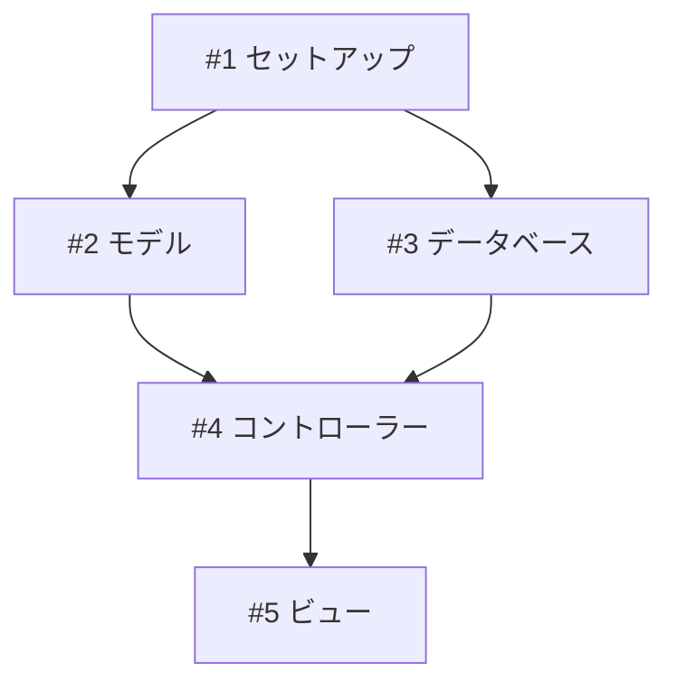

# タスク管理 - トラブルシューティング

## Q: ユーザーのタスク粒度が間違っている

**問題**: タスクが大きすぎる（>1週間）または小さすぎる（<1時間）

**解決策**:
- 大きすぎる: 「このタスクは少し大きすぎます。2-3個の小さなタスクに分割しますか？」
- 小さすぎる: 「このタスクは小さすぎます。関連タスクと結合しますか？」

例:
- 悪い: 「認証システム全体を実装」（大きすぎる）
- 良い: 「Devise gemをインストール」、「Userモデルを作成」、「登録フォームを追加」（適切なサイズ）

## Q: 依存関係が複雑

**問題**: 多くの相互依存タスクがボトルネックを作っている

**解決策**: 依存関係グラフを作成

クリティカルパスを特定し、可能な限り並列化。

## Q: タスクが多すぎる

**問題**: 50個以上のタスクに圧倒される

**解決策**: フェーズに整理
- フェーズ1: MVP（最小限の実行可能な製品）
- フェーズ2: 追加機能
- フェーズ3: 改善/最適化

まずフェーズ1に集中。

## Q: ユーザーがプロジェクト途中で計画を変更したい

**問題**: 要件が変更され、タスクの調整が必要

**解決策**:
1. 何を変更する必要があるか確認
2. タスク分解を更新
3. Issueを追加/削除/修正
4. READMEとProjectsボードを更新
5. 優先度と依存関係を再評価

## Q: チームメンバーがタスク所有権を不明確にしている

**問題**: 複数人で、誰が何をするか不明確

**解決策**:
1. GitHub assigneesを使用して特定のチームメンバーにIssueを割り当てる
2. ラベルを使用して領域を示す（frontend/backend/testing）
3. 必要に応じてIssueタイトルまたは説明にチームメンバー名を追加
